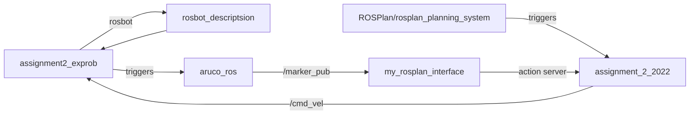

# Assignment 2 Experimental Robotics Laboratory

The second assignment of Experimental robotics laboratory asked to implement a code that controls a rosbot to perceive 4 Aruco markers and go back to its original location.
I implemented the simulation with the robot description of a rosbot which can be found in the package rosbot_description.
This github page contains a ros workspace in which I put the packages I needed to solve the problem.

# How to run it

In order to run the assignment one has to run the following:

```
roslaunch assignment2_exprob sim_aruco2.launch
roslaunch rosplan_planning_system test2.launch

rosservice call /rosplan_problem_interface/problem_generation_server
rosservice call /rosplan_planner_interface/planning_server
rosservice call /rosplan_parsing_interface/parse_plan
rosservice call /rosplan_plan_dispatcher/dispatch_plan
```
I could have made the process of running the assignment way easier by including the line of code
```<include file="$(find rosplan_planning_system)/launch/test2.launch"/>``` at the end of the sim_aruco2.launch and by creating a node that calls all the services one after the other but I preferred this way of execution.
The reason why I kept everything this way is that the first launch file is responsible of spawning the robot in the environment, the second is responsible for the control and plan, then the user that calls the services via command line can have a look at what happened in the terminal after each service was called, and creating a very trivial node that just calls once 4 services seemed to me a waste of resources: notice that the whole project requires a lot of CPU and memory.


## package: assignment2_exprob

This package contains the launch file sim_aruco2.launch that is responsible for spawning the rosbot at x=1.0 y=1.0 in the environment. This position was chosen as the starting position of every execution, the default x=0.0, y=0.0 could not be a possibility due to the presence of an obstacle. (An hypothetical "planner manager node" that calls the 4 services seen before could have gone in this package).

## package: assignment_2_2022

This package is a modified copy of my implementation of the second assignment of research track 1.
Since the unique strict requirement of the assignment was that of using ROSPlan I decided not tu use any mapping algorithm for this part but to deeply analyze and test more the assignment_2_2022 package.
This package mainly implements an action server that is given a point to reach and implements the bug0 obstacle avoidance algorithm to reach it.
With respect to the original implementation in the action server several changes had to be performed to adapt to the rosbot: mainly regarding the laser.
After reading carefully the data published on the topic /scan it was noticed that the 5 regions regions_ = {'right' : ... , 'fright' : ... , 'front': ... , 'fleft': ... , 'left': ... } were shifted, in practice also by looking at the rosbot xacro and gazebo description I deduced that the laser frame was rotated. So I had to modify the bug_as.py and wall_follow_service.py as they both use the dictionary regions_.

## package: ROSPlan

This package was modified by adding the domainExp.pddl and problemExp.pddl files and by adding the previously mentioned launch file.
Notice that here planning did not require durative actions, classical planning was enough to solve the problem. I tried to keep the code of the assignment modular and simple. Just 2 actions were enough to cover each behavior: the final point is considered a waypoint (wp0) and precedence among waypoints is hardcoded correctly in the problem file.

## package: aruco_ros

Inside the aruco_ros package  ("aruco_ros/aruco_ros/src/marker_publish_our.cpp") the code responsible for retrieving useful data from the camera is implemented. When a marker is detected a message is sent.

## package: my_rosplan_interface

This package contains the file my_action.cpp that implements the "concreteCallback" method of the class MyActionInterface.
The callback retrieves a message that is the current instruction to be executed by the robot: one of the 2 {"goto_waypoint", "searchfor_marker"}.
It switches on the first letter of the instruction ('g' or 's') and decide which behavior to implement.
If goto_waypoint was the instruction the code calls the action server in the package assignment_2_2022.
If searchfor_marker was the instruction it continuously publish an angular velocity waiting for a message from the aruco_ros package.
Every action is assumed to be performed correctly every time.
In the real world a marker could be not detected for several reasons. In this case my code makes the robot just rotate forever. A better approach would be that of replanning after a certain amount of time and going to a different waypoint (maybe skipping the current marker for the moment and coming back at it in a second moment).
Another approach could be that of making a full rotation and independently from the fact that the marker was detected or not going to the next waypoint.
Uncomment the sleep(20) lines of code inside the my_action.cpp code to reach a more 'stable' behavior.

## notice:

As seen before, the code does not handle possible failures of the camera or in general the fact that a marker is not seen. Also in simulation it may happen that a marker is not immediately seen and requires more than one turn to be seen, this is mainly due to chance (scheduling order of processes, optimizations, frame rate, caching system...).
In this case the robot will continue rotating until it finds the marker that always happened on my distribution.
Also here sleep(20) may be helpful.

## lab experience

In the lab I tried the behavior of my code on the real rosbot, in particular I decided not to run the whole assignment but just a portion of it.
In particular I decided to test the most delicate part: detection of the marker, and in particular of the first marker.
After connecting to the robot through ssh protocol and running the code on a linux distribution with shared ros master I modified the code to have the different behaviors separate. In the end the robot performed just the first switch from goto_waypoint to searchfor_marker in the correct way.

<video src="video/video1.mp4" width="320" height="240" controls></video>

### flow of the code


Here the relation between packages is depicted graphically



As we can see the only nodes in the graph (packages) that are not triggered are assignment2_exprob and ROSPlan/rosplan_planning_system, so 2 launch files are semantically helpful.
This graph is also the final version of the original idea of the implementation of the assignment. 


